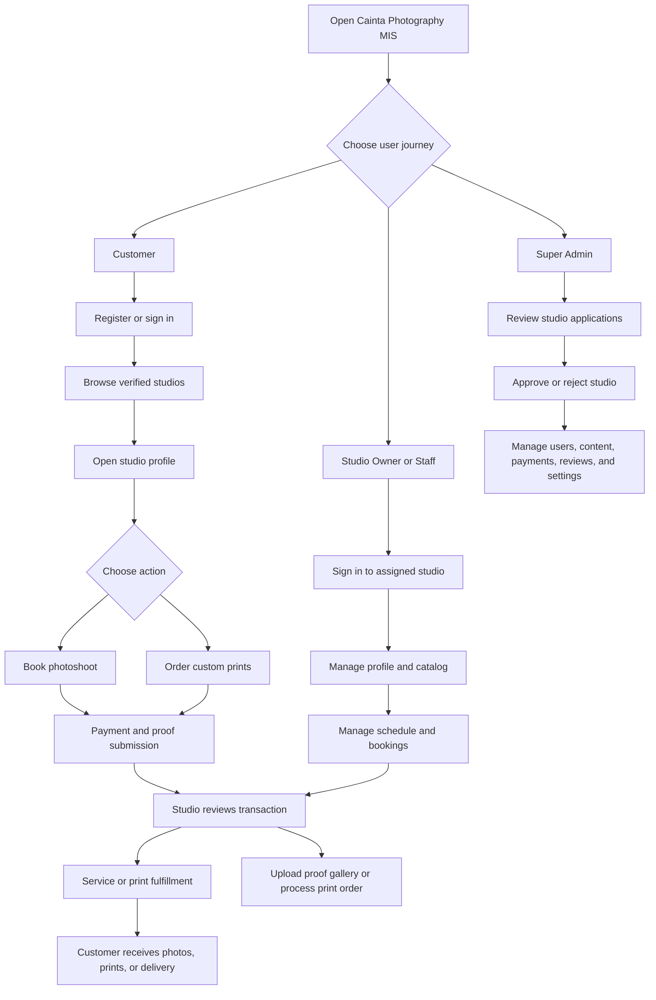
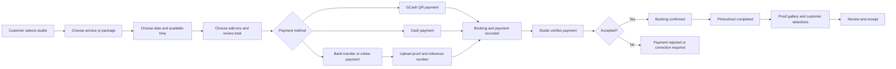
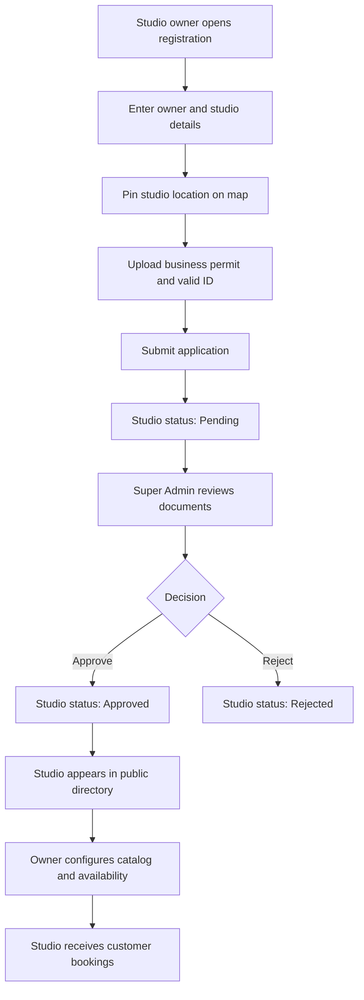

# Cainta Photography Studio MIS

## User Guide

This guide explains the complete workflow from account registration to booking completion, payment verification, photo proofing, printing, and administration.

## System Flow Overview



## Booking and Payment Flow



## Studio Registration and Approval Flow



   ## Data Flow Diagram (DFD)

   The diagram below shows how information moves between customers, studio teams, Super Admins, application processes, external services, and system data stores.

   ```mermaid
   flowchart LR
      Customer[Customer]
      StudioTeam[Studio Owner or Staff]
      Admin[Super Admin]
      Email[Email / SMTP Service]
      GCash[GCash or Payment Gateway]

      Auth((Authentication and Account Management))
      Directory((Studio Directory and Catalog))
      Booking((Booking and Availability Management))
      Payment((Payment Verification))
      Print((Print Order Fulfillment))
      Proof((Photo Proofing Gallery))
      AdminProcess((Administration and Content Management))
      Notification((Notification Service))

      Users[(Users and Customers)]
      Studios[(Studios, Services, Packages and Add-ons)]
      Schedules[(Availability and Bookings)]
      Payments[(Payments and Payment Proofs)]
      PrintOrders[(Print Products and Print Orders)]
      Media[(Protected Media Files)]
      Content[(CMS, FAQs, Pages and System Settings)]
      Audit[(Audit Logs)]

      Customer -->|Registration and login data| Auth
      Auth <-->|Account records and sessions| Users
      Auth -->|Authentication result| Customer

      Customer -->|Search, filters and profile requests| Directory
      Directory <-->|Studio and catalog data| Studios
      Directory -->|Verified studios and public profiles| Customer

      Customer -->|Service, package, date and time selection| Booking
      Booking <-->|Availability and reservation records| Schedules
      Booking <-->|Service and package prices| Studios
      Booking -->|Booking confirmation or status| Customer

      Customer -->|Payment method, reference and proof| Payment
      Payment <-->|Payment records| Payments
      Payment -->|QR payment request| GCash
      GCash -->|Payment result or transaction reference| Payment
      StudioTeam -->|Verify, approve or reject payment| Payment
      Payment -->|Payment status| Customer

      Customer -->|Product, photo, quantity and delivery details| Print
      Print <-->|Print product and order records| PrintOrders
      Print -->|Payment information| Payment
      StudioTeam -->|Confirm, process and complete order| Print
      Print -->|Order status and receipt| Customer

      StudioTeam -->|Proof photos, watermarks and final link| Proof
      Proof <-->|Protected gallery media| Media
      Customer -->|Photo selections and retouching notes| Proof
      Proof -->|Proof gallery and final delivery| Customer

      StudioTeam -->|Profile, catalog, availability and staff updates| AdminProcess
      Admin -->|Approvals, users, content and settings updates| AdminProcess
      AdminProcess <-->|Platform configuration and content| Content
      AdminProcess <-->|Studio and user records| Users
      AdminProcess <-->|Studio records| Studios
      AdminProcess -->|Administrative activity| Audit

      Booking --> Notification
      Payment --> Notification
      Print --> Notification
      AdminProcess --> Notification
      Notification -->|In-app and email alerts| Customer
      Notification -->|In-app and email alerts| StudioTeam
      Notification -->|Administrative alerts| Admin
      Notification -->|SMTP delivery| Email
   ```

   ### DFD Data Store Summary

   | Data store | Main information saved |
   | --- | --- |
   | Users and Customers | Login accounts, roles, contact details, and sessions |
   | Studios and Catalog | Studio profiles, services, packages, add-ons, and categories |
   | Availability and Bookings | Working hours, blackout dates, schedules, and booking statuses |
   | Payments | Payment amounts, methods, references, proofs, and verification status |
   | Print Products and Orders | Print catalog, uploaded photos, quantities, delivery, and fulfillment status |
   | Protected Media Files | IDs, permits, payment proofs, branding images, and proofing photos |
   | CMS and System Settings | Public content, FAQs, custom pages, themes, modules, and audio settings |
   | Audit Logs | Administrative, account, approval, and transaction-related actions |

   ## Detailed End-to-End Process Flow

   The following example shows exactly what happens when a customer books a session with a studio. Each step identifies the responsible user and the expected result.

   ### Scenario A: Customer Books a Photoshoot

   | Step | Responsible user | Action | System result |
   | --- | --- | --- | --- |
   | 1 | Customer | Registers a Customer account or signs in. | The customer account is authenticated and a session is created. |
   | 2 | Customer | Opens the Studio Directory and searches for a studio by name, location, category, price, or rating. | The system displays approved studios only. |
   | 3 | Customer | Opens the selected studio profile and reviews its services, packages, add-ons, schedule, location, and reviews. | The customer can see the studio's public catalog and available booking action. |
   | 4 | Customer | Selects **Book Appointment**. | The Booking Wizard opens for the selected studio. |
   | 5 | Customer | Selects a service or package, optional add-ons, date, time slot, and booking notes. | The system calculates the total and checks for overlapping reservations. |
   | 6 | Customer | Chooses **Downpayment** or **Full Payment** and selects GCash, bank transfer, online payment, or cash. | The system calculates the exact amount that must be paid. |
   | 7 | Customer | Pays the required amount. For manual payment, enters the reference number and uploads proof. For GCash, completes the QR payment flow. | The booking is created as pending payment or awaiting verification. |
   | 8 | System | Creates the booking, payment record, customer notification, and audit entry. | The customer receives a booking reference and can track it in the Customer Dashboard. |
   | 9 | Studio Owner or Staff | Opens **Studio Dashboard > Bookings** and reviews the customer, schedule, amount, reference number, and payment proof. | The studio can see the pending reservation and payment status. |
   | 10 | Studio Owner | Approves or rejects the submitted payment proof. | Approved payment becomes **Paid/Verified**. Rejected payment requires correction or a new proof. |
   | 11 | Studio Owner or Staff | Confirms the booking after the payment is valid. | The booking status changes from **Pending** to **Confirmed**. The customer is notified. |
   | 12 | Customer | Uploads any required document from the booking record before the appointment. | The requirement is attached to the booking and becomes visible to the studio team. |
   | 13 | Customer and Studio Team | Customer arrives for the appointment; the studio performs the photoshoot. | The studio can later mark the booking as completed. |
   | 14 | Studio Owner or Staff | Opens **Proofs**, creates a gallery, uploads watermarked proof photos, and sends the gallery to the customer. | The gallery status becomes **Sent to Client**. |
   | 15 | Customer | Selects preferred photos and adds retouching notes, then submits the selections. | The gallery status becomes **Client Reviewed** and the studio receives the selections. |
   | 16 | Studio Owner or Staff | Completes the retouching, uploads final files or adds the final delivery link, and completes the gallery. | The customer can access the final delivery information. |
   | 17 | Studio Owner | Records the remaining balance when applicable and marks the booking **Completed**. | The booking and payment totals are updated. |
   | 18 | Customer | Downloads the booking receipt and submits a rating and review. | The review enters Super Admin moderation before public display. |
   | 19 | Super Admin | Opens **Admin Dashboard > Payments** or **Review Moderation** when required. | Payment records and customer reviews can be audited or moderated. |

   ### Booking Approval Responsibility

   1. The **Customer** creates the booking and submits the payment information.
   2. The **System** checks the schedule, prevents double booking, calculates the payment amount, and records the transaction.
   3. The **Studio Owner** is responsible for approving or rejecting booking payment proofs and confirming the reservation.
   4. **Studio Staff** can assist with schedules, booking operations, proofing, and fulfillment within the assigned studio. Owner-only payment-management actions remain restricted.
   5. The **Super Admin** does not normally approve each booking. The Super Admin monitors platform-wide payments, handles review moderation, and manages users and studios.

   ### Scenario B: Customer Orders a Print

   | Step | Responsible user | Action | System result |
   | --- | --- | --- | --- |
   | 1 | Studio Owner | Adds a print product with product name, size, price, product images, and estimated fulfillment time. | The product appears in the studio's public Printing Shop. |
   | 2 | Customer | Opens the studio profile and selects **Order Custom Prints**. | The Print Order Wizard opens for that studio. |
   | 3 | Customer | Selects the print product and quantity. | The system calculates the print total. |
   | 4 | Customer | Uploads the photo to be printed and optionally checks the visual mockup. | The uploaded image is attached to the draft print order. |
   | 5 | Customer | Chooses Studio Pickup or Rizal Shipping. For delivery, enters the complete shipping address. | The delivery method is saved with the order. |
   | 6 | Customer | Chooses a payment method and uploads payment proof when required. | The print order is submitted with **Pending** order status. |
   | 7 | Studio Owner or Staff | Opens **Studio Dashboard > Prints** and checks the uploaded photo, product, quantity, delivery method, and payment. | The team can accept or reject the order payment. |
   | 8 | Studio Owner or Staff | Verifies online payment or records cash payment. | The print payment becomes **Paid**. |
   | 9 | Studio Owner or Staff | Confirms the order, starts printing, and updates the fulfillment stage. | The order moves through **Confirmed**, **Processing**, and **Quality Check**. |
   | 10 | Studio Owner or Staff | Marks pickup orders **Ready for Pickup** or dispatches delivery orders as **Out for Delivery**. | The customer receives the latest order status. |
   | 11 | Customer | Picks up the order or receives the delivery. | The studio marks the order **Completed**. |
   | 12 | Customer or Studio Owner | Downloads the print-order receipt for the completed transaction. | A PDF receipt is generated with the order and payment details. |

   ### Scenario C: Studio Owner Registration and Publication

   | Step | Responsible user | Action | System result |
   | --- | --- | --- | --- |
   | 1 | Studio Owner | Registers as a Studio Owner and enters owner and studio details. | A studio-owner account and pending studio record are created. |
   | 2 | Studio Owner | Pins the studio location and uploads the required Business Permit and Valid Government ID. | The compliance documents are stored as protected media. |
   | 3 | System | Sets the studio status to **Pending** and notifies the Super Admin. | The studio is hidden from the public directory. |
   | 4 | Super Admin | Reviews the studio profile, location, permit, ID, and supporting documents. | The application is ready for approval or rejection. |
   | 5 | Super Admin | Selects **Approve Studio** or **Reject**. | The studio becomes **Approved** or **Rejected**. |
   | 6 | System | Sends the approval result to the studio owner. | Approved owners can sign in to the Studio Portal. |
   | 7 | Studio Owner | Adds branding, services, packages, add-ons, availability, GCash details, staff, and print products. | The public studio profile becomes ready for customers. |
   | 8 | Customer | Finds the approved studio in the public directory. | The studio can now receive bookings and print orders. |

## 1. Start the System

### Requirements

- Node.js
- A configured database, using the SQL files in this repository when setting up a new environment
- `GEMINI_API_KEY` for the AI photography guide
- SMTP settings if email notifications are required

### Run locally

1. Open a terminal in the project folder.
2. Install the dependencies:

   ```bash
   npm install
   ```

3. Create `.env.local` or `.env` and add the required environment variables. At minimum, configure:

   ```env
   GEMINI_API_KEY=your_gemini_api_key
   ```

   For email notifications, also configure `SMTP_EMAIL` and `SMTP_APP_PASSWORD`. For a MySQL deployment, configure `DB_HOST`, `DB_PORT`, `DB_USER`, `DB_PASSWORD`, and `DB_NAME`.

4. Start the application:

   ```bash
   npm run dev
   ```

5. Open the local URL displayed by the development server.

## 2. Choose an Account Type

The system has four roles:

- **Customer:** Finds studios, books sessions, pays, uploads requirements, reviews work, and orders prints.
- **Studio Owner:** Manages one approved studio, its catalog, calendar, payments, staff, proofing galleries, and orders.
- **Studio Staff:** Helps operate the assigned studio, including bookings, print orders, and client proofing. Staff cannot perform owner-only account and payment-management actions.
- **Super Admin:** Approves studios, manages users and the platform, moderates payments and reviews, and configures public content.

All users sign in from the Login page using their registered email and password. A customer may also use Google sign-in when Google login has been configured by the deployment administrator. Use **Forgot Password** to request an email OTP, verify the six-digit code, and create a new password.

## 3. Customer: Register and Find a Studio

1. Open the public landing page.
2. Select **Sign In / Register** and switch to registration.
3. Choose **Customer** as the account type.
4. Enter your full name, email, password, contact number, and address.
5. Submit the form. Customer accounts become available immediately.
6. Return to the landing page and use **Find Studios**, a photography category, or **Explore All Studios**.
7. In the directory, search by studio name, location, or road. You can also filter by photography category, maximum starting price, and minimum rating.
8. Use the map, grid, or split view to compare studios. Select **View Studio** to open a studio profile.

## 4. Customer: Review a Studio

1. Check the studio's verification badge, location map, business hours, contact information, address, and starting price.
2. Review the **Photography Services**, **Customizable Packages**, **Printing Shop**, and **Verified Reviews** tabs.
3. Open portfolio images for a larger preview.
4. Select the heart icon to save or remove the studio from favorites. Saved studios are available from the customer dashboard.
5. Use the **Cainta Photo Guide** chatbot for questions about services, packages, operating hours, or booking. Chatbot action buttons can take you directly to services, packages, or booking.

## 5. Customer: Book a Photoshoot

You must be signed in to complete a booking.

1. From a studio profile, select **Book Appointment**.
2. Complete the booking wizard in order:
   1. **Service:** Select the photography service.
   2. **Package:** Select an available package, if applicable.
   3. **Schedule:** Choose a date and an available time slot. The system checks existing reservations and prevents overlapping bookings.
   4. **Add-ons:** Select optional add-ons.
   5. **Summary:** Review the service, package, add-ons, schedule, notes, and total price.
   6. **Payment:** Choose **Downpayment** or **Full Payment**, then choose a payment method.
3. For a downpayment, enter the exact amount shown by the system. The default downpayment is 30% of the booking total.
4. Complete payment:
   - **GCash:** Use the displayed QR payment flow and wait for the payment result.
   - **Bank Transfer** or **Online Payment:** Enter the reference number and upload an image proof of payment.
   - **Cash:** Confirm the booking and settle with the studio according to its instructions.
5. Submit the booking. Save the booking reference shown in the confirmation.
6. Open **My Bookings** in the customer dashboard to monitor the booking and payment status.

### Booking handoff

1. The customer submits the booking and payment information.
2. The studio owner reviews the reservation and any payment proof.
3. The studio owner can approve or reject a pending payment. When the payment is verified, the booking can be confirmed.
4. The customer can upload any required document from the booking card.
5. The studio marks the reservation **Completed** after the photoshoot. The remaining balance can be recorded by the studio owner when applicable.
6. A verified booking receipt can be downloaded as a PDF from the customer or studio workspace.

## 6. Customer: Upload Requirements, Review Photos, and Leave a Review

### Upload a requirement

1. Open **My Bookings**.
2. Select the booking's requirement upload action.
3. Choose the requested file and submit it. The uploaded filename is shown to the studio team.

### Review proof photos

1. When the studio creates a proofing gallery, open the gallery from the completed or active booking.
2. Review the watermarked proof images.
3. Select the photos you want finalized or printed.
4. Add retouching feedback notes to individual photos when needed.
5. Submit the selections and notes to the studio.
6. After final processing, use the final delivery link supplied by the studio when it is available.

### Submit a review

1. Open the eligible booking in **My Bookings**.
2. Select the review action.
3. Choose a rating from 1 to 5 stars and write a comment.
4. Submit the review. It may remain pending until approved by the Super Admin.

## 7. Customer: Order Custom Prints

1. Open a studio profile that has printing enabled.
2. Select **Order Custom Prints**.
3. Complete the print wizard:
   1. **Product:** Select a print product and quantity.
   2. **Photo:** Upload the photo to print. Use the mockup preview to check the frame, backdrop, finish, and scaling.
   3. **Delivery:** Choose **Studio Pickup** or **Rizal Shipping**. Enter a complete address for delivery.
   4. **Payment:** Review the total and choose GCash, bank transfer, online payment, or cash.
   5. **Submit:** For non-cash payment, upload proof of payment. Enter the reference number when requested, then submit the order.
4. Track the order from the **Print Orders** section of the customer dashboard.
5. For a pickup order, collect it after the studio marks it **Ready for Pickup**. For delivery, monitor the order until it becomes **Out for Delivery** and then **Completed**.
6. Download the print-order receipt when it becomes available.

## 8. Studio Owner: Register a Studio

There are two onboarding paths.

### Owner self-registration

1. Open **Sign In / Register** and choose **Studio Owner**.
2. Enter the owner account details and studio name.
3. Enter the studio address and set the map pin by searching, clicking the map, or dragging the marker.
4. Upload both required documents:
   - DTI or Mayor's Business Permit
   - Valid Government ID
5. Add optional supporting documents, then submit the registration.
6. The studio is created with a **Pending** status. Wait for Super Admin approval before signing in to the Studio Portal.

### Super Admin onboarding

The Super Admin can create the owner account and studio directly from **Admin Dashboard > Studios & Approvals > Onboard Studio**. This path creates an approved studio immediately after the form is submitted.

## 9. Super Admin: Approve a Studio

1. Sign in with a Super Admin account.
2. Open **Admin Dashboard** and select **Studios & Approvals > Pending Approvals**.
3. Open the submitted Business Permit, Owner Valid ID, and supporting documents.
4. Verify the owner, studio information, location, and documents.
5. Select **Approve Studio** to publish the studio and enable the owner portal, or select **Reject** when the application does not meet requirements.
6. Approved studios appear in the public directory. The owner receives an in-app notification and email when SMTP is configured.

## 10. Studio Owner: Configure the Studio

After approval, sign in and open the Studio Dashboard.

1. Open **Management > Branding & Profile**.
2. Upload a logo and cover image.
3. Confirm the Cainta area, map coordinates, address, business hours, contact information, description, starting price, and photography categories.
4. Save the profile and verify the public studio page.
5. Open **Management > Services & Catalog** and add or edit:
   - Photography services with category, price, duration, description, and sample images
   - Custom packages with duration, edited-photo count, included prints, and photographer count
   - Add-ons
   - Print products with size, price, photos, and estimated fulfillment hours
6. Open **Management > Availability & Calendar** to configure working hours, slot duration, blackout dates, and availability rules.
7. Open **Management > GCash & Payments** to configure the studio merchant name and GCash number when using the QR payment flow.
8. Use **Management > Studio FAQs** to add answers that help customers and the chatbot.

## 11. Studio Owner: Manage Staff

1. Open **Management > Staff Accounts**.
2. Enter the staff member's name, email, contact number, and an optional password.
3. Create the staff account and give the staff member the sign-in details securely.
4. Staff members sign in with the **Studio Staff** role and work only within the assigned studio.
5. Remove staff access from the same tab when the staff member no longer works with the studio.

## 12. Studio Owner or Staff: Process Bookings and Payments

1. Open **Bookings** in the Studio Dashboard.
2. Review the customer details, date, time, selected service, requirements, booking status, and payment status.
3. Open the payment proof and compare the reference number and amount with the submitted booking.
4. The studio owner verifies or rejects pending payment proofs. Staff can assist with operations but owner-only payment controls remain restricted.
5. For a valid reservation, select **Approve Booking** or update the booking to **Confirmed**.
6. If the customer has an outstanding balance, record the final balance after receiving it.
7. After the photoshoot, select **Fulfill Shoot** to mark the booking **Completed**.
8. Use the **Calendar** tab to review the schedule and open proofing galleries for individual bookings.

## 13. Studio Owner or Staff: Manage Proofing and Print Orders

### Photo proofing

1. From a booking, select **Proofs**.
2. Create or open the booking's client gallery.
3. Upload proof photos, configure watermark text, position, and opacity, then send the gallery to the customer.
4. Review the customer's selected photos and retouching notes.
5. Upload final photos or add the final delivery link, then mark the gallery complete when finished.

### Print orders

1. Open **Prints** in the Studio Dashboard.
2. Review the uploaded photo, product, quantity, total, delivery method, payment status, and order status.
3. Verify online payment proofs or record a cash payment.
4. Move the order through the available fulfillment stages:
   - **Pending** to **Confirmed**
   - **Confirmed** to **Processing**
   - **Processing** to **Quality Check** for pickup, or **Out for Delivery** for shipping
   - **Quality Check** to **Ready for Pickup**
   - **Ready for Pickup** or **Out for Delivery** to **Completed**
5. Download or provide the print-order receipt after processing.

## 14. Super Admin: Manage the Platform

Use the Admin Dashboard for platform-wide operations:

- **Studios & Approvals:** Review applications, onboard studios, and view verified studios.
- **Payment Ledger:** Monitor payment records grouped by studio and open payment proofs.
- **Review Moderation:** Approve or reject customer reviews before they are publicly visible.
- **Users:** Create accounts, filter by role, approve or reject studio-owner accounts, suspend approved owners, and remove non-Super-Admin users.
- **Categories:** Add, edit, or remove photography categories used in studio profiles and directory filters.
- **Content & FAQs:** Update landing-page copy, hero imagery, About content, FAQs, and chatbot FAQ suggestions.
- **Page Builder:** Create published or draft custom pages using hero, text, gallery, FAQ, pricing, and CTA blocks. Pages can be shown in the navigation menu.
- **Theme & UI:** Change colors, font family, header style, and other system presentation settings.
- **Modules:** Enable or disable booking, printing, maps, chatbot, sound, and related platform modules.
- **Audio:** Configure approved system audio.
- **Audit Log:** Review recorded administrative and account actions.
- **Admin Account:** Update Super Admin account details and password.

## 15. Notifications and Account Settings

1. Select the notification bell to read system updates such as studio approvals, payment results, booking changes, and password-reset events.
2. Open **Account Settings** to update your name, email, contact number, and address.
3. To change your password, enter the current password and a new password of at least six characters.
4. Sign out when finished, especially on shared devices.

## 16. Common Statuses

### Studio statuses

- **Pending:** Waiting for Super Admin review.
- **Approved:** Published and able to receive bookings.
- **Rejected:** Registration was declined.
- **Suspended:** Access or publication has been disabled.

### Booking statuses

- **Pending / Awaiting Payment:** Created but not yet fully confirmed.
- **Confirmed:** Accepted by the studio.
- **Completed:** Photoshoot fulfilled.
- **Cancelled / Rejected / Expired:** No longer active.

### Payment statuses

- **Unpaid:** No payment has been recorded.
- **Pending Verification:** The studio must review the submitted payment.
- **Paid / Verified:** Payment was accepted.
- **Rejected / Failed:** Payment was not accepted.

### Print-order statuses

- **Pending:** Order submitted.
- **Confirmed:** Studio accepted the order.
- **Processing:** Printing has started.
- **Quality Check:** Print is being checked before pickup.
- **Ready for Pickup:** Customer can collect the order.
- **Out for Delivery:** Order has been dispatched.
- **Completed:** Order finished.

## 17. Operational Tips

- Customers should keep their booking reference and payment reference number.
- Studio owners should verify payment amount and proof before confirming a booking or print order.
- Studio owners should keep their public profile, availability, catalog, and GCash details current.
- Never share passwords or payment credentials in chat or public studio descriptions.
- Use protected in-app document and media previews for permits, IDs, payment proofs, and proof photos.

## Development Commands

```bash
npm run dev     # Start the application locally
npm run build   # Build the frontend and server bundle
npm run lint    # Run the TypeScript check
```
