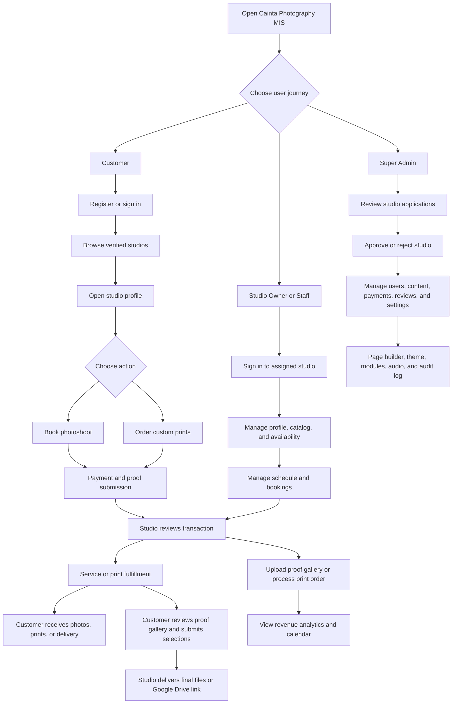
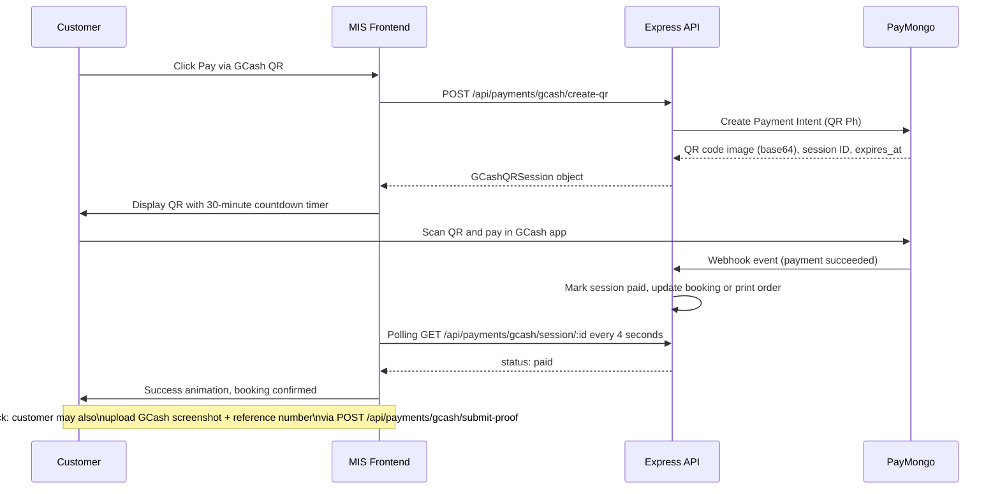
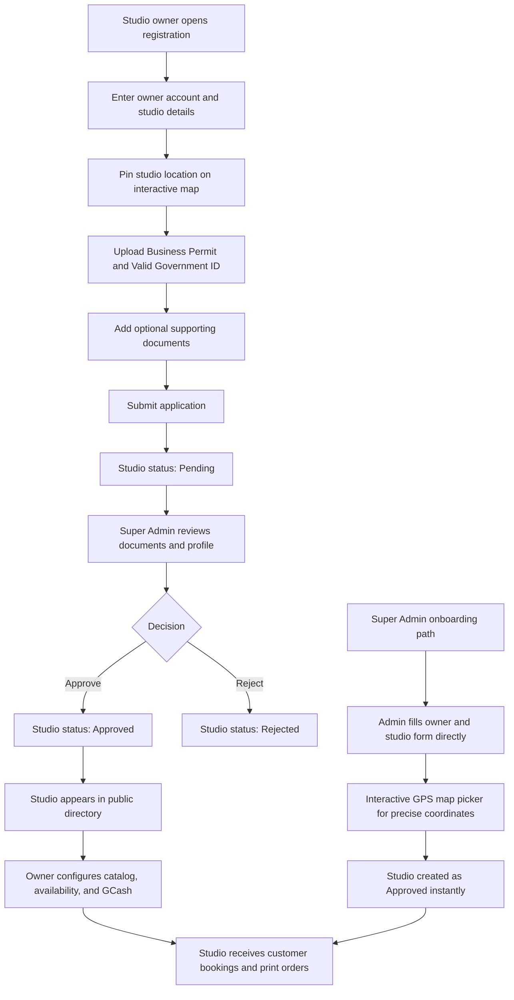
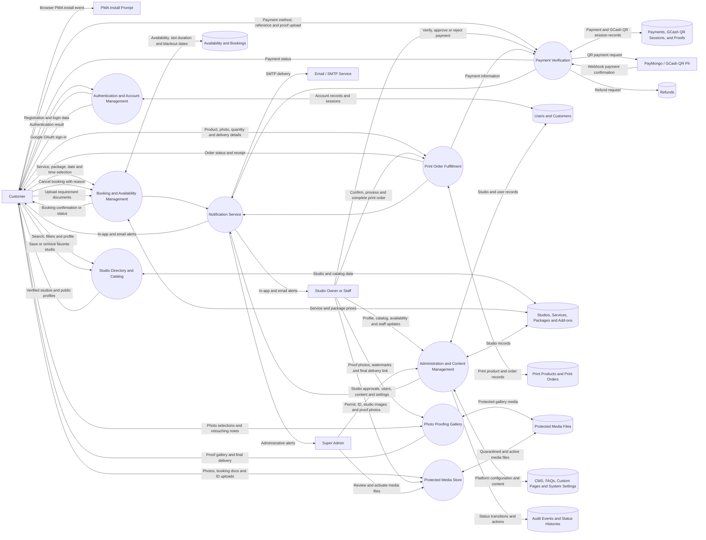
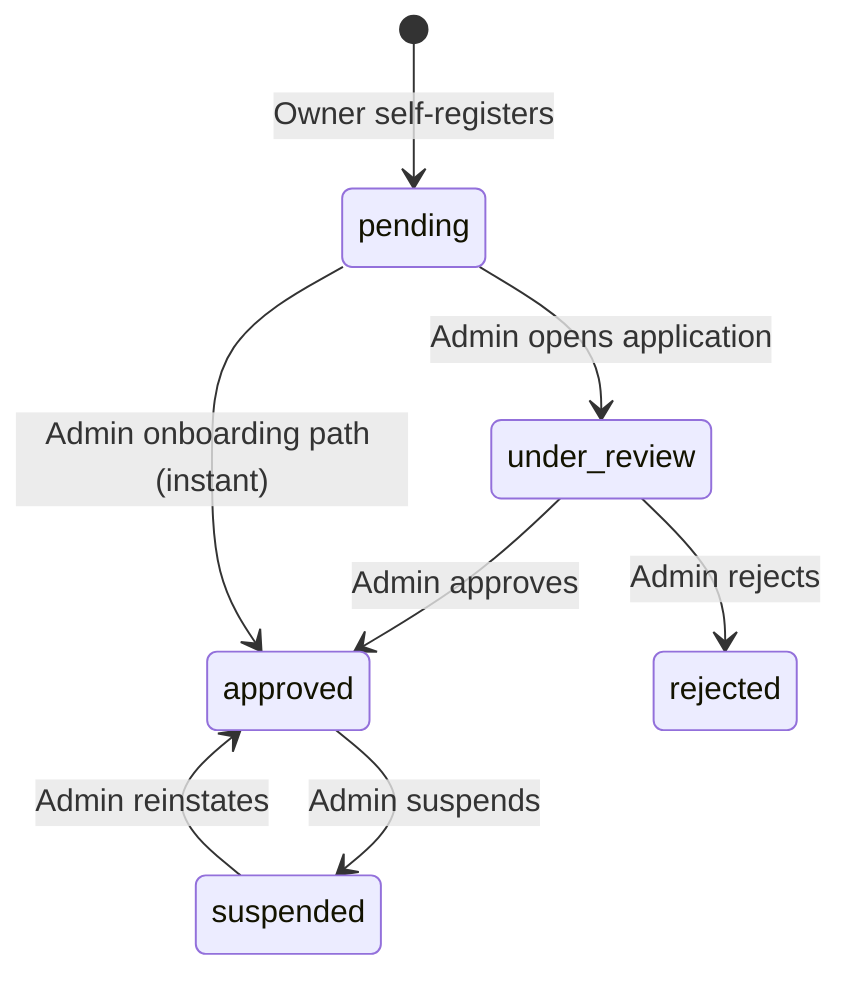
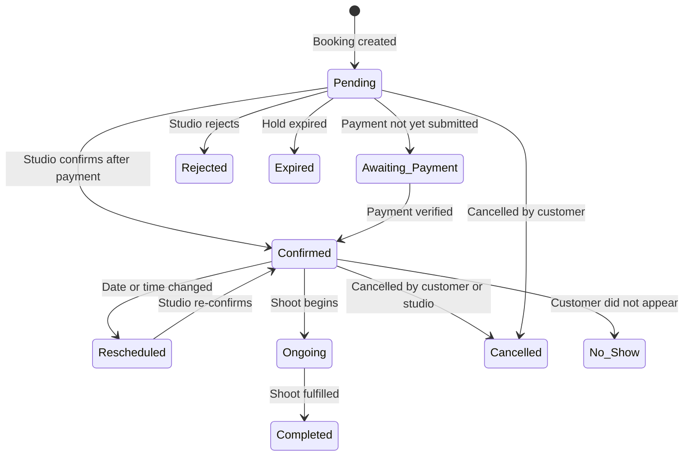
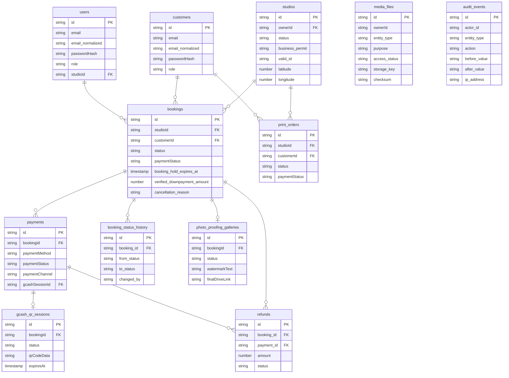

# Cainta Photography Studio MIS

## User Guide

This guide covers the complete workflow from account registration to booking completion, payment verification, photo proofing, printing, and administration.

---

## System Flow Overview



---

## Booking and Payment Flow

```mermaid
flowchart LR
   A[Customer selects studio] --> B[Choose service or package]
   B --> C[Choose date and available time slot]
   C --> D[Select add-ons and review total]
   D --> E{Payment option}
   E --> E1[Downpayment - 30 percent]
   E --> E2[Full Payment]
   E1 --> PM{Payment method}
   E2 --> PM
   PM --> F[GCash QR - PayMongo QR Ph]
   PM --> G[Bank transfer or online payment - manual proof]
   PM --> H[Cash]
   F --> I[Booking and payment recorded]
   G --> J[Upload proof and reference number]
   H --> I
   J --> I
   I --> K[Studio verifies payment]
   K --> L{Accepted?}
   L -->|Yes| M[Payment: Paid or Verified]
   L -->|No| N[Payment: Rejected - correction required]
   M --> O[Studio confirms booking]
   O --> P[Customer arrives - photoshoot completed]
   P --> Q[Studio uploads watermarked proof gallery]
   Q --> R[Customer selects photos and adds retouching notes]
   R --> S[Studio delivers final files or Google Drive link]
   S --> T[Customer downloads receipt and submits review]
```



### GCash QR Payment Detail



---

## Studio Registration and Approval Flow



---

## Data Flow Diagram (DFD)

The diagram below shows how information moves between customers, studio teams, Super Admins, application processes, external services, and system data stores.



### DFD Data Store Summary

| Data Store | Main Information Saved |
| --- | --- |
| Users and Customers | Login accounts, roles, contact details, Google OAuth, and sessions |
| Studios and Catalog | Studio profiles, services, packages, add-ons (with images), print products, GPS coordinates, and categories |
| Availability and Bookings | Working hours per day, slot duration, blackout dates, booking statuses, and status history audit trail |
| Payments, GCash QR Sessions, and Proofs | Payment amounts, methods, references, proofs, GCash QR session state, expiry, fraud scores, and verification status |
| Refunds | Refund requests linked to bookings and payments with amount, reason, and status |
| Print Products and Orders | Print catalog, uploaded photos, quantities, delivery addresses, and fulfillment status |
| Protected Media Files | IDs, permits, payment proofs, proof photos, hero images, and catalog images — each with owner, purpose, checksum, and access status |
| CMS and System Settings | Hero content, About content, FAQs, custom pages, theme colors, module toggles, audio settings, and font/header preferences |
| Audit Events and Status Histories | Security audit trail (before/after values, IP address) plus per-entity booking and payment status transition logs |

---

## Detailed End-to-End Process Flow

### Scenario A: Customer Books a Photoshoot

| Step | Responsible | Action | System Result |
| --- | --- | --- | --- |
| 1 | Customer | Registers a Customer account or signs in (local or Google OAuth). | Account authenticated; session created. |
| 2 | Customer | Opens the Studio Directory and searches by name, location, category, price range, or rating. | Only approved studios are shown. |
| 3 | Customer | Opens a studio profile, reviews services, packages, add-ons, schedule, location, and reviews. | Public catalog and booking action are visible. |
| 4 | Customer | Selects **Book Appointment**. | Booking Wizard opens for the selected studio. |
| 5 | Customer | Selects a service, optional package, add-ons, date, time slot, and booking notes. | System calculates total and checks for overlapping reservations. |
| 6 | Customer | Chooses **Downpayment** (30 percent) or **Full Payment**, then selects a payment method. | System calculates the exact amount due. |
| 7 | Customer | Pays the required amount. For GCash QR, scans the QR code in the GCash app. For manual payment, uploads proof and reference number. For cash, confirms the booking. | Booking created as Pending or Awaiting Payment. PayMongo webhook confirms QR payments automatically. |
| 8 | System | Creates booking, payment record, GCash QR session (if applicable), customer notification, and audit entry. | Customer receives a booking reference and can track it in their dashboard. |
| 9 | Studio Owner or Staff | Opens **Studio Dashboard → Bookings**, reviews reservation, amount, reference, and proof image. | Pending reservation and payment status are visible. |
| 10 | Studio Owner | Approves or rejects the submitted payment. | Approved becomes **Paid / Verified**. Rejected requires a new proof submission. |
| 11 | Studio Owner | Confirms the booking. | Status changes to **Confirmed**. Customer is notified. |
| 12 | Customer | Uploads any required document from the booking card (e.g., dress code reference, theme mood board). | Document attached and visible to the studio team. |
| 13 | Customer and Studio Team | Customer arrives; photoshoot is performed. | Studio can mark the booking as Ongoing or Completed. |
| 14 | Studio Owner or Staff | Opens **Proofs**, creates a gallery, uploads watermarked proof photos, configures watermark text and position, and sends the gallery to the customer. | Gallery status: **Sent to Client**. |
| 15 | Customer | Reviews proof photos, selects favorites, adds per-photo retouching notes, and submits selections. | Gallery status: **Client Reviewed**. Studio receives selections. |
| 16 | Studio Owner or Staff | Completes editing, uploads final files or adds a Google Drive delivery link, marks gallery **Completed**. | Customer can access final delivery. |
| 17 | Studio Owner | Records remaining balance when applicable; marks booking **Completed**. | Payment totals updated. |
| 18 | Customer | Downloads the booking receipt PDF; submits a star rating and written review. | Review enters Super Admin moderation before public display. |
| 19 | Super Admin | Moderates reviews in **Admin Dashboard → Review Moderation** when needed. | Approved reviews appear on the studio's public profile. |

### Booking Approval Responsibility

1. The **Customer** creates the booking and submits payment information.
2. The **System** checks the schedule, prevents double-booking, calculates payment amounts, and records the transaction.
3. The **Studio Owner** is responsible for approving or rejecting payment proofs and confirming the reservation.
4. **Studio Staff** can assist with booking operations, proofing, and print fulfillment. Owner-only controls (payment management, staff management) remain restricted.
5. The **Super Admin** does not approve individual bookings. The Super Admin monitors platform-wide payments, moderates reviews, and manages users and studios.

---

### Scenario B: Customer Orders a Print

| Step | Responsible | Action | System Result |
| --- | --- | --- | --- |
| 1 | Studio Owner | Adds a print product with name, size, price, product images, and estimated fulfillment hours. | Product appears in the studio's public Printing Shop. |
| 2 | Customer | Opens the studio profile and selects **Order Custom Prints**. | Print Order Wizard opens for that studio. |
| 3 | Customer | Selects the print product and quantity. | System calculates the print total. |
| 4 | Customer | Uploads the photo to be printed; uses the mockup preview to check frame style, paper sheen, backdrop, and scaling. | Uploaded image is attached to the draft print order. |
| 5 | Customer | Chooses **Studio Pickup** or **Rizal Shipping**. Enters a complete address for delivery orders. | Delivery method saved with the order. |
| 6 | Customer | Chooses a payment method and uploads proof when required. | Print order submitted with **Pending** status. |
| 7 | Studio Owner or Staff | Opens **Studio Dashboard → Prints**, reviews the uploaded photo, product, quantity, delivery method, and payment. | Team can accept or reject the order payment. |
| 8 | Studio Owner or Staff | Verifies online payment proof or records a cash payment. | Print payment becomes **Paid**. |
| 9 | Studio Owner or Staff | Confirms the order, starts printing, and updates the fulfillment stage. | Order moves through **Confirmed → Processing → Quality Check**. |
| 10 | Studio Owner or Staff | Marks pickup orders **Ready for Pickup** or dispatches delivery orders as **Out for Delivery**. | Customer receives the latest status notification. |
| 11 | Customer | Picks up the order or receives the delivery. | Studio marks the order **Completed**. |
| 12 | Customer or Studio Owner | Downloads the print-order receipt PDF for the completed transaction. | PDF receipt generated with order and payment details. |

---

### Scenario C: Studio Owner Registration and Publication

| Step | Responsible | Action | System Result |
| --- | --- | --- | --- |
| 1 | Studio Owner | Registers as a Studio Owner and enters owner account and studio details. | Studio-owner account and pending studio record created. |
| 2 | Studio Owner | Pins the studio location on the interactive map and uploads the DTI or Mayor's Business Permit and Valid Government ID. | Compliance documents stored as protected media with quarantine status until reviewed. |
| 3 | System | Sets studio status to **Pending** and notifies the Super Admin. | Studio hidden from the public directory. |
| 4 | Super Admin | Reviews studio profile, location, permit, ID, and supporting documents. | Application ready for decision. |
| 5 | Super Admin | Selects **Approve Studio** or **Reject**. | Studio becomes **Approved** or **Rejected**. |
| 6 | System | Sends result to the studio owner via in-app notification and email (when SMTP is configured). | Approved owners can sign in to the Studio Portal. |
| 7 | Studio Owner | Adds branding, services, packages, add-ons, availability, GCash details, staff, and print products. | Public studio profile becomes ready for customers. |
| 8 | Customer | Finds the approved studio in the public directory. | Studio can now receive bookings and print orders. |

---

## Status Reference

### Studio Statuses



| Status | Meaning |
| --- | --- |
| `pending` | Newly registered; waiting for Super Admin review |
| `under_review` | Application is actively being reviewed |
| `approved` | Published and able to receive bookings |
| `rejected` | Registration was declined |
| `suspended` | Previously approved but publication and access disabled |

---

### Booking Statuses



| Status | Meaning |
| --- | --- |
| `Pending` | Booking created; initial state |
| `Awaiting Payment` | Created but payment not yet submitted |
| `Confirmed` | Accepted by the studio after payment verification |
| `Rescheduled` | Date or time changed after initial confirmation |
| `Ongoing` | Photoshoot is currently in progress |
| `Completed` | Photoshoot fulfilled; review becomes available |
| `Cancelled` | Cancelled by customer or studio; stores reason, cancelled-by, and timestamp |
| `Rejected` | Rejected by studio admin |
| `Expired` | Booking hold time window elapsed without payment |
| `No Show` | Customer did not appear for the appointment |

---

### Payment Statuses

| Status | Meaning |
| --- | --- |
| `Unpaid` | No payment has been recorded |
| `Pending Verification` | Manual proof submitted; studio must review |
| `Partially Paid` | Downpayment received; balance outstanding |
| `Paid / Verified` | Payment accepted |
| `Refunded` | Payment returned to customer |
| `Failed` | Payment was not accepted or transaction failed |

### Payment Types

| Type | Description |
| --- | --- |
| `Downpayment` | 30 percent of booking total; default option |
| `Balance` | Remaining amount after downpayment |
| `Full Payment` | Complete booking amount in one transaction |
| `PrintOrder` | Payment for a print order |

### Payment Channels

| Channel | Description |
| --- | --- |
| `gcash_qr` | Scanned via PayMongo QR Ph flow |
| `manual_upload` | Customer uploaded GCash screenshot and reference number |
| `bank_transfer` | Bank wire or online banking |
| `cash` | In-person cash payment |

---

### Print Order Statuses

```mermaid
stateDiagram-v2
   [*] --> Pending : Order placed
   Pending --> Confirmed : Studio accepts order
   Confirmed --> Processing : Printing begins
   Processing --> Quality_Check : Print completed; QA underway
   Quality_Check --> Ready_for_Pickup : Passed QA (pickup orders)
   Processing --> Out_for_Delivery : Dispatched (shipping orders)
   Ready_for_Pickup --> Completed : Customer collects
   Out_for_Delivery --> Completed : Delivery confirmed
   Pending --> Cancelled : Cancelled by customer or studio
   Confirmed --> Cancelled : Cancelled
```



| Status | Meaning |
| --- | --- |
| `Pending` | Order submitted; awaiting studio confirmation |
| `Confirmed` | Studio accepted the order |
| `Processing` | Printing is in progress |
| `Quality Check` | Print complete; undergoing inspection and framing |
| `Ready for Pickup` | Passed QA; available at the studio counter |
| `Out for Delivery` | Dispatched via courier for shipping orders |
| `Completed` | Order fulfilled |
| `Cancelled` | Cancelled by customer or studio |

### Photo Proofing Gallery Statuses

| Status | Meaning |
| --- | --- |
| `draft` | Gallery created by studio; not yet shared with customer |
| `sent_to_client` | Gallery sent to customer for review |
| `client_reviewed` | Customer submitted photo selections and retouching notes |
| `completed` | Studio delivered final files or Google Drive link |

---

## Architecture and Tech Stack

```mermaid
flowchart LR
   subgraph Frontend
      React19[React 19 + TypeScript]
      Vite[Vite 6]
      Tailwind[Tailwind CSS 4]
      Motion[Framer Motion 12]
      Recharts[Recharts 3]
      Leaflet[Leaflet.js]
      jsPDF[jsPDF]
   end

   subgraph Backend
      Express[Express 4 on Node.js]
      TSX[tsx - dev server]
      ESBuild[esbuild - production bundle]
   end

   subgraph Database
      MySQL[MySQL - mysql2 driver]
   end

   subgraph External
      Gemini[Google Gemini AI - Chatbot]
      PayMongo[PayMongo - GCash QR Ph]
      Gmail[Gmail SMTP - Nodemailer]
      Cloudinary[Cloudinary - optional media CDN]
   end

   subgraph Deployment
      Firebase[Firebase Hosting plus Functions]
      Vercel[Vercel Frontend]
      Render[Render.com Backend]
      Railway[Railway - Cloud MySQL]
   end

   Frontend --> Backend
   Backend --> Database
   Backend --> External
   Frontend --> Deployment
   Backend --> Deployment
   Database --> Deployment
```



---

## Database Schema Overview

The schema is set up by importing `cainta_photography_mis.sql` and then applying the five migrations in order.



### Migration Summary

| Migration | Changes |
| --- | --- |
| `001_integrity_foundation.sql` | Email normalization with unique indexes; booking hold expiry, cancellation fields; `booking_status_history` and `payment_status_history` audit tables; `refunds` table; `media_files` table with access-status workflow; `audit_events` table |
| `002_add_valid_id_to_studios.sql` | Adds `business_permit`, `valid_id`, and `other_docs` columns to studios table for compliance document storage and admin review |
| `003_persistent_media.sql` | Adds `purpose` column to `media_files` (e.g. `PROOF_PHOTO`, `HERO_BACKGROUND`, `LEGACY`) with index for categorized media retrieval |
| `004_fix_gcash_qr_expiry.sql` | Removes `ON UPDATE CURRENT_TIMESTAMP` from `gcash_qr_sessions.expires_at`; status updates no longer inadvertently reset the QR expiry time |
| `005_catalog_images.sql` | Adds `image` column to the `addons` table so add-on items can display catalog images in the Booking Wizard |

---

## 1. Start the System

### Requirements

- Node.js 20 or later
- A configured MySQL database (import `cainta_photography_mis.sql`, then run migrations 001–005)
- `GEMINI_API_KEY` for the AI photography guide chatbot
- SMTP settings when email notifications are required
- PayMongo API keys when using GCash QR payments

### Run locally

1. Open a terminal in the project folder.
2. Install the dependencies:

   ```bash
   npm install
   ```

3. Create `.env.local` or `.env` and configure the required variables:

   ```env
   # Database
   DB_HOST=localhost
   DB_PORT=3306
   DB_USER=root
   DB_PASSWORD=
   DB_NAME=cainta_photography_mis

   # AI Chatbot
   GEMINI_API_KEY=your_gemini_api_key

   # Email notifications (optional)
   SMTP_EMAIL=your_gmail@gmail.com
   SMTP_APP_PASSWORD=your_app_password
   EMAIL_FROM=your_gmail@gmail.com

   # GCash QR payments (optional)
   PAYMONGO_SECRET_KEY=sk_test_...
   PAYMONGO_PUBLIC_KEY=pk_test_...
   PAYMONGO_WEBHOOK_SECRET=whsk_...
   PAYMONGO_MODE=sandbox
   CREDENTIAL_ENCRYPTION_KEY=your_32_byte_hex_key
   ```

4. Start the application:

   ```bash
   npm run dev
   ```

5. Open the local URL shown by the development server.

---

## 2. Account Types and Roles

The system has four roles:

| Role | Description |
| --- | --- |
| **Customer** | Finds studios, books sessions, pays, uploads requirements, reviews proof photos, submits ratings, orders prints, and manages favorites. |
| **Studio Owner** | Manages one approved studio including catalog, calendar, payments, staff, proofing galleries, print orders, revenue analytics, and GCash credentials. |
| **Studio Staff** | Helps operate the assigned studio (bookings, print orders, proofing). Cannot manage downpayments, create or remove staff, or change billing settings. |
| **Super Admin** | Approves studios, manages all users and platform content, moderates payments and reviews, and configures system-wide settings, themes, modules, and audio. |

All users sign in from the Login page using email and password. Customers may also use **Google sign-in** when configured. Use **Forgot Password** to request an email OTP, verify the six-digit code, and set a new password.

---

## 3. Customer: Register and Find a Studio

1. Open the public landing page.
2. Select **Sign In / Register** and switch to the registration form.
3. Choose **Customer** as the account type.
4. Enter your full name, email, password, contact number, and address.
5. Submit. Customer accounts are active immediately.
6. Return to the landing page and use **Find Studios**, a photography category link, or **Explore All Studios**.
7. Search by studio name, location, or street. Filter by photography category, maximum starting price, and minimum rating.
8. Use the map, grid, or split view to compare studios. Select **View Studio** to open a studio profile.

---

## 4. Customer: Review a Studio

1. Check the studio's verification badge, location map, business hours, contact information, address, and starting price.
2. Browse the **Photography Services**, **Customizable Packages**, **Printing Shop**, and **Verified Reviews** tabs.
3. Open portfolio images for a larger preview.
4. Select the heart icon to save or remove the studio from **Favorites**. Saved studios are accessible from the customer dashboard.
5. Use the **Cainta Photo Guide** AI chatbot for questions about services, packages, operating hours, or booking. Chatbot action buttons can navigate you directly to services, packages, or the booking wizard.
6. Use the **Studio Price Estimator** widget to estimate session costs before booking.

---

## 5. Customer: Book a Photoshoot

You must be signed in to complete a booking.

1. From a studio profile, select **Book Appointment**.
2. Complete the booking wizard:
   1. **Service** — Select the photography service.
   2. **Package** — Select an available package if applicable.
   3. **Schedule** — Choose a date and available time slot. The system checks existing reservations and prevents overlapping bookings.
   4. **Add-ons** — Select optional add-ons (each may have a catalog image).
   5. **Summary** — Review the service, package, add-ons, schedule, notes, and total price.
   6. **Payment** — Choose **Downpayment** (30 percent) or **Full Payment**, then choose a payment method.
3. Complete payment:
   - **GCash QR** — A 30-minute QR code is generated. Open GCash, tap "Pay QR", scan the code, and confirm. The system confirms automatically via PayMongo webhook. You may also submit a GCash screenshot and reference number as a hybrid fallback.
   - **Bank Transfer or Online Payment** — Enter the reference number and upload an image proof.
   - **Cash** — Confirm the booking and settle with the studio according to its instructions.
4. Submit the booking. Save the booking reference shown in the confirmation.
5. Open **My Bookings** in the customer dashboard to monitor booking and payment status.
6. Sync your appointment to **Google Calendar** or download an **.ics** file for Apple Calendar or Outlook.

### Booking Handoff

1. Customer submits booking and payment information.
2. System checks the schedule, prevents double-booking, calculates payment amounts, and records the transaction.
3. Studio owner reviews the reservation and any payment proof, then approves or rejects.
4. Customer can upload required documents from the booking card.
5. Studio marks the booking **Completed** after the photoshoot. Remaining balance can be recorded by the studio owner when applicable.
6. A verified booking receipt PDF is downloadable from the customer or studio workspace.

---

## 6. Customer: Upload Requirements, Review Photos, and Leave a Review

### Upload a requirement

1. Open **My Bookings**.
2. Select the requirement upload action on the booking card.
3. Choose the requested file and submit. The filename is shown to the studio team.

### Review proof photos

1. When the studio sends a proofing gallery, open it from the active or completed booking.
2. Review the watermarked proof images.
3. Select the photos you want finalized or printed (star to mark as selected).
4. Add per-photo retouching feedback notes when needed.
5. Submit selections and notes to the studio.
6. After final processing, use the Google Drive delivery link supplied by the studio.

### Submit a review

1. Open the eligible completed booking in **My Bookings**.
2. Select the review action.
3. Choose a rating from 1 to 5 stars and write a comment.
4. Submit. The review may remain pending until approved by the Super Admin.

---

## 7. Customer: Order Custom Prints

1. Open a studio profile with printing enabled.
2. Select **Order Custom Prints**.
3. Complete the print wizard:
   1. **Product** — Select a print product and quantity.
   2. **Photo** — Upload the photo to print. Use the mockup preview to check frame style (black, oak, gold, or frameless), paper sheen (glossy or matte), backdrop, and scaling.
   3. **Delivery** — Choose **Studio Pickup** or **Rizal Shipping**. Enter a complete address for delivery.
   4. **Payment** — Review the total and choose a payment method. For non-cash, upload proof of payment.
4. Track the order from the **Print Orders** section of the customer dashboard. The progress bar and milestone timeline show the current fulfillment stage.
5. For a pickup order, collect it after the studio marks it **Ready for Pickup**. For delivery, monitor the order until **Completed**.
6. Download the print-order receipt PDF when available.

---

## 8. Studio Owner: Register a Studio

### Owner self-registration

1. Open **Sign In / Register** and choose **Studio Owner**.
2. Enter owner account details and studio name.
3. Enter the studio address and set the map pin by searching, clicking the map, or dragging the marker.
4. Upload both required documents: DTI or Mayor's Business Permit, and Valid Government ID.
5. Add optional supporting documents, then submit.
6. The studio is created with **Pending** status. Wait for Super Admin approval before accessing the Studio Portal.

### Super Admin onboarding

The Super Admin can create the owner account and studio directly from **Admin Dashboard → Studios & Approvals → Onboard Studio**. This path creates an approved studio immediately, bypassing the pending queue.

---

## 9. Super Admin: Approve a Studio

1. Sign in with a Super Admin account.
2. Open **Admin Dashboard → Studios & Approvals → Pending Approvals**.
3. Open the submitted Business Permit, Owner Valid ID, and supporting documents from the protected media viewer.
4. Verify the owner details, studio information, location, and documents.
5. Select **Approve Studio** to publish the studio and enable the owner portal, or **Reject** when requirements are not met.
6. Approved studios appear in the public directory. The owner receives an in-app notification and email (when SMTP is configured).

---

## 10. Studio Owner: Configure the Studio

After approval, sign in and open the Studio Dashboard.

1. Open **Management → Branding & Profile**.
2. Upload a logo and cover image.
3. Confirm the Cainta area, GPS coordinates, address, business hours, contact information, description, starting price, and photography categories.
4. Save the profile and verify the public studio page.
5. Open **Management → Services & Catalog** and add or edit:
   - Photography services (category, price, duration, description, and multiple sample images)
   - Custom packages (duration, edited-photo count, included prints, photographer count)
   - Add-ons (name, price, description, and catalog image)
   - Print products (size, price, multiple product images, and estimated fulfillment hours)
6. Open **Management → Availability & Calendar** to configure per-day-of-week working hours, slot duration (30 / 60 / 90 / 120 min), and blackout dates.
7. Open **Management → GCash & Payments** to enter the studio merchant name and GCash number used during the QR payment flow.
8. Open **Management → Studio FAQs** to add answers that help customers and the AI chatbot.

---

## 11. Studio Owner: Manage Staff

1. Open **Management → Staff Accounts**.
2. Enter the staff member's name, email, contact number, and an optional temporary password.
3. Create the account and share the sign-in details with the staff member securely.
4. Staff sign in with the **Studio Staff** role and can only work within the assigned studio.
5. Remove staff access from the same tab when the person no longer works at the studio.

---

## 12. Studio Owner or Staff: Process Bookings and Payments

1. Open **Bookings** in the Studio Dashboard.
2. Review customer details, date, time, selected service, requirements doc status, booking status, and payment status.
3. Open the payment proof image and compare the reference number and amount with the submitted booking.
4. The studio owner approves or rejects pending payment proofs (staff cannot perform this action).
5. For a valid reservation, confirm the booking to change its status to **Confirmed**.
6. If the customer has an outstanding balance, record the final balance after receiving it.
7. After the photoshoot, select **Fulfill Shoot** to mark the booking **Completed**.
8. Open the **Calendar** tab to review the schedule in a month-grid view, use the agenda list on mobile, or open proofing galleries for individual bookings.

---

## 13. Studio Owner or Staff: Manage Proofing and Print Orders

### Photo proofing

1. From a booking, select **Proofs**.
2. Create or open the booking's client gallery.
3. Upload proof photos via the file picker or drag-and-drop.
4. Configure watermark text, position (center, bottom-right, or diagonal repeat), and opacity.
5. Send the gallery to the customer.
6. Review the customer's selected photos and retouching notes.
7. Upload final edited files or add the Google Drive delivery link, then mark the gallery **Completed**.

### Print orders

1. Open **Prints** in the Studio Dashboard.
2. Review the uploaded photo, product, quantity, total, delivery method, payment status, and order status.
3. Verify online payment proofs or record a cash payment.
4. Advance the order through the fulfillment stages:
   - **Pending → Confirmed → Processing → Quality Check → Ready for Pickup** (pickup orders)
   - **Pending → Confirmed → Processing → Out for Delivery → Completed** (shipping orders)
5. Download or provide the print-order receipt after completing the order.

---

## 14. Studio Owner: View Revenue Analytics

1. Open **Reports** in the Studio Dashboard.
2. Select the chart type: **Composed** (bar + trend line), **Stacked** (bars by type), or **Area** (trend fill).
3. Select the time period: daily (14 days), weekly (12 weeks), monthly (6 months), or yearly (5 years).
4. Review the summary cards for booking income, print sales, and combined total.
5. Open the **Ledger** toggle for an itemized list of transactions with a grand total.
6. Export a **PDF Sales Report** covering the selected period.

---

## 15. Super Admin: Manage the Platform

Use the Admin Dashboard for platform-wide operations:

| Section | What you can do |
| --- | --- |
| **Studios & Approvals** | Review pending applications, view compliance documents, approve or reject studios, and onboard studios directly via the admin form. |
| **Payment Ledger** | Monitor payment records grouped by studio, view amounts, payment methods, reference numbers, and open payment proof images. |
| **Review Moderation** | Approve or reject customer reviews before they are publicly visible. |
| **Users** | Create accounts for any role, filter by role, approve or reject studio-owner accounts, suspend approved owners, and remove non-Super-Admin users. |
| **Categories** | Add, edit, or remove photography categories used in studio profiles and directory filters. |
| **Content & FAQs** | Update hero title, hero subtitle, hero background image, About section, global FAQs, and approve chatbot FAQ suggestions. |
| **Page Builder** | Create published or draft custom pages using hero, text, gallery, FAQ, pricing, and CTA blocks. Reorder blocks with drag-and-drop. Toggle pages in the navigation menu. |
| **Theme & UI** | Change primary color, accent color, background color, font family, header style. View the local network URL for kiosk access. Test SMTP email delivery. |
| **Modules** | Enable or disable: booking, printing, maps, chatbot, sound effects. Set the demo video URL. |
| **Audio** | Upload and preview custom background audio (MP3, WAV, M4A, OGG). Enable or disable system-wide audio playback. |
| **Audit Log** | Review an immutable, reverse-chronological log of all administrative and account actions including before and after values. |
| **Admin Account** | Update the Super Admin's own profile details and password. |

---

## 16. UI and UX Features

### Progressive Web App (PWA)

The system supports installation as a native-like app on Android, iOS, Windows, and macOS.
- On Chrome or Android: a banner appears after 3 seconds with an **Install** button.
- On iOS Safari: instructions guide the user to tap Share then "Add to Home Screen".
- Once installed, the app runs in standalone mode without a browser address bar.
- App icons are located at `public/icons/icon-192.png`, `icon-512.png`, and `icon.svg`.

### Interactive Motion Components

The front end includes a suite of physics-based UI components:

| Component | Description |
| --- | --- |
| `Interactive3DTiltCard` | CSS perspective tilt with spring physics and a specular shine glare that follows the mouse cursor |
| `MagnetButton` | Buttons with up to 14 px of magnetic cursor attraction and spring snap-back |
| `LensFocusCursor` | Custom DSLR autofocus reticle cursor with crosshair lines and corner brackets (desktop only) |
| `AperturePageTransition` | Blur and scale page entrance and exit animation |
| `ScrollProgressBar` | Fixed film-strip-themed scroll progress bar at the top of the page |
| `ScrollReveal` | Viewport-triggered reveal animation with configurable direction and delay |
| `BeforeAfterSlider` | Drag handle comparing RAW and retouched studio photos side by side |
| `CameraViewfinderHUD` | Interactive camera simulator with ISO, aperture, and shutter controls and a rule-of-thirds grid |
| `StudioPriceEstimator` | Live session cost calculator with person count, HMUA, USB, and frame size options |

### Sound Engine

Web Audio API-based sound effects that play on UI interactions:
- Shutter click on booking confirmations
- Success chord on payment completion
- Pop on card hover
- Focus beep on secondary interactions

Sound effects are globally toggleable from **Admin → Modules**.

---

## 17. Notifications and Account Settings

1. Select the notification bell to read system updates such as studio approvals, payment results, booking changes, and password-reset events.
2. Filter notifications by type: All, Info, Success, Warning, or Error.
3. Clicking a notification navigates to the relevant section of the dashboard.
4. Open **Account Settings** to update your full name, email, contact number, and address.
5. To change your password, enter the current password and a new password of at least six characters.
6. Sign out when finished, especially on shared devices.

---

## 18. Deployment Options

### Option A: Full Firebase (Recommended)

- **Frontend:** Firebase Hosting (React + Vite SPA on Google CDN)
- **Backend:** Firebase Cloud Functions 2nd Gen (Express API, Node 20)
- **Database:** Cloud MySQL (Railway, Google Cloud SQL, Aiven, or TiDB)
- Requires Firebase Blaze plan for outbound MySQL connections.

```bash
npm run deploy:firebase        # Deploy both frontend and backend
npm run deploy:hosting         # Deploy frontend only
npm run deploy:functions       # Deploy backend only
```

Live URL: `https://one-cainta-photography-mis.web.app`

See `DEPLOYMENT_FIREBASE.md` for the full setup guide.

### Option B: Vercel (Frontend) + Firebase Functions (Backend)

- **Frontend:** Vercel Edge Network with GitHub continuous deployment
- **Backend:** Firebase Cloud Functions 2nd Gen
- `vercel.json` rewrites `/api/*` to the Firebase function URL
- No CORS configuration required.

See `DEPLOYMENT_VERCEL_FIREBASE.md` for the full setup guide.

### Option C: Firebase Hosting (Frontend) + Render.com (Backend)

- **Frontend:** Firebase Hosting (free Spark Plan)
- **Backend:** Render.com Free Web Service (Node.js, Singapore region for PH latency)
- CORS allowed origins configured via `FRONTEND_ORIGINS` environment variable on Render.

See `DEPLOYMENT_RENDER_FIREBASE.md` for the full setup guide.

---

## 19. Common Operational Tips

- Customers should keep their booking reference and payment reference number.
- Studio owners should verify the payment amount and proof before confirming a booking or print order.
- GCash QR codes expire after 30 minutes. If expired, generate a new QR code from the customer dashboard.
- Studio owners should keep their public profile, availability, catalog, and GCash details current.
- Never share passwords or payment credentials in chat or public studio descriptions.
- Use protected in-app document and media previews for permits, IDs, payment proofs, and proof photos — these require authentication to access.

---

## Development Commands

```bash
npm run dev              # Start the application locally (tsx server.ts)
npm run build            # Build frontend (Vite) and server bundle (esbuild)
npm run build:frontend   # Build frontend only
npm run build:backend    # Build server bundle only
npm run build:functions  # Build Firebase Cloud Functions
npm run start            # Start the production server (dist/server.cjs)
npm run lint             # Run the TypeScript type check
npm run import:db        # Import SQL files via tsx scripts/import-sql.ts
```
